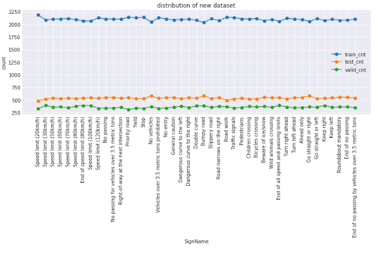
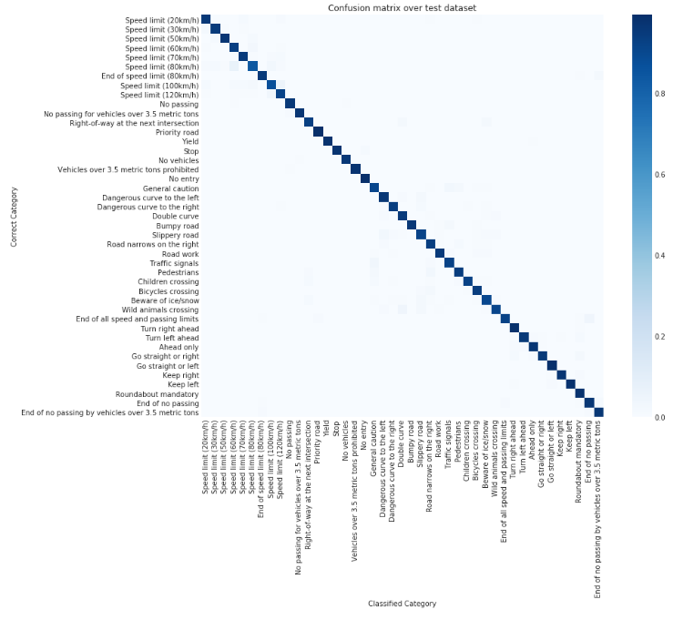

# **Traffic Sign Recognition** 

---

**Build a Traffic Sign Recognition Project**

The goals / steps of this project are the following:
* Load the data set (see below for links to the project data set)
* Explore, summarize and visualize the data set
* Design, train and test a model architecture
* Use the model to make predictions on new images
* Analyze the softmax probabilities of the new images
* Summarize the results with a written report

[//]: # (Image References)

[image1]: ./examples/visualization.jpg "Visualization"
[image2]: ./examples/grayscale.jpg "Grayscaling"
[image3]: ./examples/random_noise.jpg "Random Noise"
[image4]: ./examples/placeholder.png "Traffic Sign 1"
[image5]: ./examples/placeholder.png "Traffic Sign 2"
[image6]: ./examples/placeholder.png "Traffic Sign 3"
[image7]: ./examples/placeholder.png "Traffic Sign 4"
[image8]: ./examples/placeholder.png "Traffic Sign 5"

## Rubric Points
### Rubric points [rubric points](https://review.udacity.com/#!/rubrics/481/view).

#### Files Submitted 

| Files         		|     Submitted	        					| 
|:---------------------:|:---------------------------------------------:| 
| Ipython notebook with code | Yes   							| 
| HTML output of the code | Yes 	|
| A writeup report (either pdf or markdown) | Yes (Markdown) |

--- 
## Data Set Summary & Exploration

### 1. Provide a basic summary of the data set. In the code, the analysis should be done using python, numpy and/or pandas methods rather than hardcoding results manually.

I used pandas dataframe to view simple dataset stats

### 2. Include an exploratory visualization of the dataset.

Here is an exploratory visualization of the data set. Following is the categorical overview of the dataset. I've randomly selected for each class.

Following is the data distribution of the classes. 

--- 
## Design and Test a Model Architecture

### 1. Describe how you preprocessed the image data. 
#### What techniques were chosen and why did you choose these techniques? Consider including images showing the output of each preprocessing technique. Pre-processing refers to techniques such as converting to grayscale, normalization, etc. (OPTIONAL: As described in the "Stand Out Suggestions" part of the rubric, if you generated additional data for training, describe why you decided to generate additional data, how you generated the data, and provide example images of the additional data. Then describe the characteristics of the augmented training set like number of images in the set, number of images for each class, etc.)

As a first step, I decided to augment the dataset to have reasonable enough data
First I've merged the splitted dataset ( train, valid, test ) again to use them as a image pool to generate new image. 

The distribution of the merged image pool look as below. 

I've sampled images from the pool, applied intensity changes, rotation, translate, sheering transformation. 
Following shows examples of generated images. This way we could consider more reasonable real world examples.

Following shows the count of each category in the augmented dataset.

Note that orange distribution is the merged image pool 
And the uniform blue distribution is the newly generated augmented dataset 

I've splitted the augmented dataset into train / validation / test dataset. 
Each of them also has uniform distribution. 
Getting more data and making each class uniform, it also helps avoiding overfitting. 

And following shows the categorical sample images of the augmented dataset.

I've also considered normalization of images.
There are couple of ways to do this. 
One could compute overal mean and std from the whole dataset.
But to cope with more real nature, I've decided to apply in-image normalization. 
I've used tensorflow api for that, rather than doing this directly on numpy array level or using opencv api. 
I've applied the normalization in the my model, so to make it easier to use. 

#### Ref. tensorflow.per_image_standardization : https://www.tensorflow.org/versions/r1.0/api_docs/python/tf/image/per_image_standardization

### 2. Describe what your final model architecture looks like including model type, layers, layer sizes, connectivity, etc.) Consider including a diagram and/or table describing the final model.

I've used the LeNet MNIST model we've used in the course and tweaked the model as shown below. 
My final model consisted of the following layers:

| Layer         		|     Description	        					| 
|:---------------------:|:---------------------------------------------:| 
| Input         		| 32x32x3 RGB image   							| 
| Batch normalization	| 32x32x3 RGB image -> 32x32x3 normalized imgs	| 
| Convolution 5x5     	| 1x1 stride, same padding, outputs 28x28x6 	|
| RELU					|												|
| Max pooling	      	| 2x2 stride,  outputs 14x14x6 				|
| Convolution 5x5	    | 1x1 stride, same padding, outputs 10x10x16	|
| Max pooling	      	| 2x2 stride,  outputs 5x5x16 				|
| Flatten | Flatten. Input = 5x5x16. Output = 400. |
| Fully connected		| 400 x 120   									|
| Apply Dropout | dropout regularization |
| Fully connected		| 120 x 84   									|
| Softmax				| 84 x 42 output 								|

### 3. Describe how you trained your model. The discussion can include the type of optimizer, the batch size, number of epochs and any hyperparameters such as learning rate.

I've used the same setup as we've used in the LeNet MNIST model,
except that I've applied dropout regularization in the first fully connected layer. 
cross_entropy was used as the loss function, and applied Adam optimizaer with rate = 0.001 
as for dropout I've applied about 0.6. 

In general, batch_size = 128, epoch = 25 showed a good result. 

### 4. Describe the approach taken for finding a solution and getting the validation set accuracy to be at least 0.93. Include in the discussion the results on the training, validation and test sets and where in the code these were calculated. Your approach may have been an iterative process, in which case, outline the steps you took to get to the final solution and why you chose those steps. Perhaps your solution involved an already well known implementation or architecture. In this case, discuss why you think the architecture is suitable for the current problem.

Given the setup explained in above section 3, the training accurary showed following learning curve. The dashed red line is the validation accurary of 0.93 

It crossed the requirement around epoch 10.
after 25 epoch, it shoed 0.947 validation accurary. 

test_set accurary of the model was 0.875 

As it was required in the project description, I've started the training with LeNetLab. 

As I don't use graysacle image as input, I've changed the input placeholder tensor so to take 3 channel images. 

Then, after several iteration, I've applied image normalization using tensorflow per image standardization.

To make it better learn I've applied dropout regularization on fully connected layers, then I figured it out applying dropout in the first fully connected layer is just good enough. Tried different values for dropout and 0.6 showed a good result.

I computed confusion matrix,

As one can see we clearly see the thick diagonal line, 
Therefore, it verifies that the model was trained well. 

I also computed confusion matrix over whole merged original dataset. 
(the pickled train / valid / test set )

I also computed confusion matrix over whole dataset, 

In this case, accuracy decreases for the classes that originally had way less samples than the thicker ones. It is related to the dataset quality, as for those classes less accurate, the majority of their sample were artificially generated ones. ( with distortions such as rotation, translate, sheer, intensity change, etc. )

Following is the prediction result of categorically sampled images from the whole augmented dataset.

---
## Test a Model on New Images

### 1. Choose five German traffic signs found on the web and provide them in the report. For each image, discuss what quality or qualities might be difficult to classify.

Here are 8 German traffic signs that I found on the web:

### 2. Discuss the model's predictions on these new traffic signs and compare the results to predicting on the test set. At a minimum, discuss what the predictions were, the accuracy on these new predictions, and compare the accuracy to the accuracy on the test set (OPTIONAL: Discuss the results in more detail as described in the "Stand Out Suggestions" part of the rubric).

Here are the results of the prediction:

The model was able to correctly guess 7 of the 8 traffic signs, which gives an accuracy of 87%. 
This compares favorably to the accuracy on the test set of 0.875 ( exactly the same ) 

### 3. Describe how certain the model is when predicting on each of the five new images by looking at the softmax probabilities for each prediction. Provide the top 5 softmax probabilities for each image along with the sign type of each probability. (OPTIONAL: as described in the "Stand Out Suggestions" part of the rubric, visualizations can also be provided such as bar charts)

Here are the results of the prediction with top 5 ranks for each images. 

---
## (Optional) Visualizing the Neural Network (See Step 4 of the Ipython notebook for more details)
### 1. Discuss the visual output of your trained network's feature maps. What characteristics did the neural network use to make classifications?

I changed the featuremap code a bit, so it can select any tensorflow element in the graph given a name 

Following shows feature map of conv2d of my selected 8 traffic signs.

As we can see, the convolutional layer is well activated so it can capture dominant visual aspect of given input images. 

The convolutional layer passing max pool, it became smaller while it captures the dominant visual aspect still 

